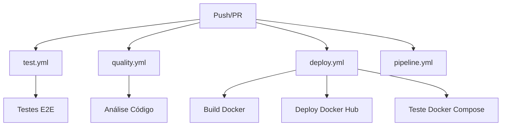

# 🚀 GitHub Actions - Estrutura Modular

## 📁 Arquivos de Workflow

### 🔄 **test.yml** - Testes E2E

- **Função**: Executa testes automatizados com Playwright
- **Triggers**: Push/PR para `main` e `develop`
- **Artifacts**: Relatórios HTML e JSON dos testes
- **Duração**: ~5-10 minutos

### 🔍 **quality.yml** - Análise de Qualidade

- **Função**: Verifica qualidade do código
- **Triggers**: Push/PR para `main` e `develop`
- **Verificações**: ESLint, Prettier, npm audit
- **Duração**: ~2-3 minutos

### 🐳 **deploy.yml** - Build e Deploy

- **Função**: Build Docker e deploy para Docker Hub
- **Triggers**: Push/PR para `main` e `develop`
- **Deploy**: Apenas na branch `develop`
- **Duração**: ~10-15 minutos

### 📊 **pipeline.yml** - Status Geral

- **Função**: Mostra status geral da pipeline
- **Triggers**: Push/PR para `main` e `develop`
- **Duração**: ~30 segundos

## 🔄 Fluxo de Execução



## ✅ Vantagens da Estrutura Modular

### 🎯 **Execução Independente**

- Cada workflow executa independentemente
- Falha em um não bloqueia os outros
- Permite debug mais fácil

### 🔧 **Manutenção Simplificada**

- Cada arquivo tem responsabilidade específica
- Mais fácil de encontrar e corrigir problemas
- Permite modificações isoladas

### 📊 **Visibilidade Melhorada**

- Status claro de cada etapa
- Logs organizados por funcionalidade
- Artifacts específicos por workflow

## 🚀 Como Usar

### 1. **Execução Automática**

Todos os workflows executam automaticamente em:

- Push para `main` ou `develop`
- Pull Request para `main` ou `develop`

### 2. **Execução Manual**

1. Vá em **Actions** no GitHub
2. Selecione o workflow desejado
3. Clique em **Run workflow**

### 3. **Verificar Status**

- **Actions** > Veja todos os workflows
- Clique em cada workflow para ver detalhes
- Baixe artifacts conforme necessário

## 📋 Configuração Necessária

### Secrets do GitHub

```bash
DOCKER_USERNAME=seu_usuario_dockerhub
DOCKER_PASSWORD=sua_senha_dockerhub
```

### Scripts do package.json

```json
{
  "test:ci": "CI=1 npx playwright test",
  "lint": "eslint \"{src,apps,libs,test}/**/*.ts\" --fix"
}
```

## 🔍 Troubleshooting

### Problemas Comuns

1. **Testes falhando**
   - Verifique `test.yml` > Logs do Playwright
   - Confirme se dependências estão instaladas

2. **Qualidade falhando**
   - Verifique `quality.yml` > Logs do ESLint
   - Execute `npm run lint` localmente

3. **Deploy falhando**
   - Verifique `deploy.yml` > Logs do Docker
   - Confirme se secrets estão configuradas

### Logs Úteis

- **test.yml**: Logs dos testes E2E
- **quality.yml**: Logs do ESLint/Prettier
- **deploy.yml**: Logs do Docker build/deploy

## 📈 Monitoramento

### Status Badges

```markdown


```

### Notificações

Configure notificações para:

- Falhas em qualquer workflow
- Deploy bem-sucedido
- Testes falhando

---

**🎉 Estrutura modular implementada com sucesso!**

Agora cada funcionalidade tem seu próprio workflow, facilitando manutenção e debug.
