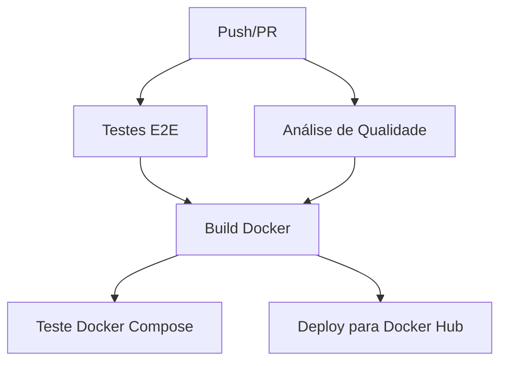

# 🚀 CI/CD Pipeline - POS Tech Challenge

## 📋 Visão Geral

A pipeline de CI/CD foi atualizada para incluir **testes E2E com Playwright** e **análise de qualidade de código**, mantendo toda a funcionalidade existente de build e deploy Docker.

## 🔄 Fluxo da Pipeline



## 📊 Jobs da Pipeline

### 1. **test** - Testes E2E com Playwright

- ✅ Instala dependências Node.js
- ✅ Gera cliente Prisma
- ✅ Instala browsers do Playwright
- ✅ Executa testes E2E (`npm run test:ci`)
- ✅ Upload de relatórios de teste
- ✅ Upload de resultados JSON

### 2. **quality** - Análise de Qualidade

- ✅ Executa ESLint (`npm run lint`)
- ✅ Verifica formatação com Prettier
- ✅ Auditoria de segurança (`npm audit`)

### 3. **build-and-push** - Build e Deploy Docker

- ✅ Build da imagem Docker
- ✅ Push para Docker Hub (apenas na branch develop)
- ✅ Cache otimizado para builds
- ✅ Tags automáticas (latest + SHA)

### 4. **test-docker-compose** - Testes de Integração

- ✅ Testa Docker Compose completo
- ✅ Verifica saúde da aplicação
- ✅ Testa conectividade com PostgreSQL
- ✅ Limpeza automática dos containers

## 🎯 Triggers

A pipeline executa em:

- **Push** para branches `main` e `develop`
- **Pull Request** para branches `main` e `develop`

## 📈 Artifacts Gerados

### Relatórios de Teste

- `playwright-report/` - Relatório HTML detalhado
- `test-results/` - Resultados JSON dos testes

### Imagens Docker

- `username/pos-tech-challenge-2:latest`
- `username/pos-tech-challenge-2:develop-{SHA}`

## 🔧 Configuração Necessária

### Secrets do GitHub (Settings > Secrets and variables > Actions)

```bash
# Obrigatórias para deploy
DOCKER_USERNAME=seu_usuario_dockerhub
DOCKER_PASSWORD=sua_senha_dockerhub

# Opcionais (já configuradas no workflow)
JWT_SECRET=test-secret-key-for-github-actions
POSTGRES_DB=school_portal_db
POSTGRES_USER=postgres
POSTGRES_PASSWORD=postgres
```

## 🚀 Como Usar

### 1. **Execução Automática**

- Faça push para `develop` ou `main`
- A pipeline executará automaticamente
- Veja o progresso na aba **Actions** do GitHub

### 2. **Execução Manual**

- Vá em **Actions** > **CI/CD Pipeline**
- Clique em **Run workflow**
- Selecione a branch e execute

### 3. **Verificar Resultados**

- Acesse a aba **Actions**
- Clique no workflow executado
- Baixe artifacts se necessário

## 📊 Monitoramento

### Status Badges (adicione ao README.md)

```markdown

```

### Logs e Debug

- **Actions** > Selecione o workflow > Veja logs detalhados
- **Artifacts** > Baixe relatórios de teste
- **Docker Hub** > Veja imagens publicadas

## 🔍 Troubleshooting

### Problemas Comuns

1. **Testes falhando**
   - Verifique se todas as dependências estão instaladas
   - Confirme se o banco de dados está configurado corretamente

2. **Build Docker falhando**
   - Verifique se as secrets do Docker Hub estão configuradas
   - Confirme se o Dockerfile está correto

3. **Deploy não executando**
   - Deploy só acontece na branch `develop`
   - Verifique se as secrets estão configuradas

### Logs Úteis

- **test**: Logs dos testes Playwright
- **quality**: Logs do ESLint e Prettier
- **build-and-push**: Logs do Docker build
- **test-docker-compose**: Logs dos containers

## 🎉 Benefícios da Pipeline Atualizada

- ✅ **Testes automatizados** antes de cada deploy
- ✅ **Qualidade de código** garantida
- ✅ **Build e deploy** automatizados
- ✅ **Testes de integração** com Docker
- ✅ **Relatórios detalhados** de testes
- ✅ **Cache otimizado** para builds rápidos
- ✅ **Limpeza automática** de recursos

---

**🎯 Sua pipeline está completa e otimizada!**

Agora cada push/PR será automaticamente testado, analisado, buildado e deployado (se aplicável).
